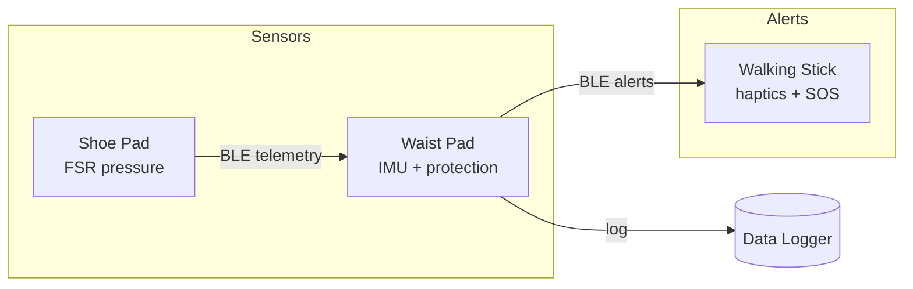

# System Architecture

## Overview

The WalkingStick platform is a three-node wearable system for gait monitoring, fall detection, and local alerting. Each node runs independent firmware built from this repository but shares a common BLE protocol and safety library.

## Device roles

### Waist safety pad (hub)

- Primary **data collector** — receives telemetry from shoe pads and stores samples in an in-memory ring buffer (SD card hooks reserved).
- **Fall and impact detection** via waist-mounted IMU.
- **Protection** — padded enclosure around the waist; firmware triggers buzzer on critical events.
- BLE peripheral that advertises the WalkingStick service.
- **Media recommendation engine** — rule-based music and podcast suggestions based on time of day, wearer preference, and gait activity.

### Shoe pad (sensor node)

- Four FSR (force-sensitive resistor) channels: left/right heel and toe.
- Detects **gait imbalance** when left/right pressure ratio exceeds threshold.
- Streams pressure telemetry to the waist pad over BLE.

### Walking stick (alert node)

- **BLE central** — scans for other nodes on the WalkingStick service.
- **SOS button** on the handle triggers a local haptic alert.
- **Vibration motor** for fall/low-battery warnings.
- Battery monitoring via ADC.
- **Podcast and music player** — elderly-friendly tactile buttons (play, next, volume, recommend) with haptic confirmation.
- **Media recommendations** — requests curated music and podcast picks from the waist hub over BLE.

## Protocol

Defined in `include/protocol.h`.

| Type | Purpose |
|------|---------|
| `SensorSample` | Timestamped accel and/or pressure reading |
| `AlertEvent` | Level, type, source, and message |
| `TelemetryPacket` | Versioned envelope sent over BLE |

BLE service UUID: `a1b2c3d4-e5f6-7890-abcd-ef1234567890`

Characteristics:

- `TELEMETRY_CHAR` — notify sensor data
- `ALERT_CHAR` — notify safety events
- `COMMAND_CHAR` — media commands from walking stick (play, volume, preferences)
- `MEDIA_CHAR` — notify music/podcast recommendations to walking stick

### Media and recommendations

The walking stick acts as a podcast and music player with inputs designed for elderly users:

| Button | Short press | Long press |
|--------|-------------|------------|
| Play | Play / pause | — |
| Next | Next track | Previous track |
| Volume | Volume up | Volume down |
| Recommend | Request recommendations | Cycle content preference |

Preferences: calm music, upbeat music, news podcasts, story podcasts, or classic favorites.

The waist hub generates recommendations using time of day and gait irregularity (calming picks when gait is uneven). Playback auto-pauses during safety alerts.

Defined in `include/protocol.h`, `include/media_player.h`, `include/media_recommendations.h`, and `include/elderly_input.h`.

## Safety logic

`SafetyMonitor` in `include/safety.h` evaluates:

1. **Fall detection** — accelerometer magnitude above `FALL_ACCEL_THRESHOLD_G`
2. **Impact detection** — magnitude above `IMPACT_THRESHOLD_G` (higher threshold)
3. **Gait irregularity** — left/right pressure imbalance above 60%

Thresholds are configurable in `include/config.h`.

## Build matrix

| Environment | Board | Source filter |
|-------------|-------|---------------|
| `waist_safety_pad` | ESP32 | `src/waist_safety_pad/` |
| `shoe_pad` | ESP32 | `src/shoe_pad/` |
| `walking_stick` | ESP32 | `src/walking_stick/` |

Each environment sets `DEVICE_ROLE` and `BLE_DEVICE_NAME` via compile flags in `platformio.ini`.

## Future extensions

- SD card persistence on waist pad (`pins::waist::SD_CS`)
- Wi-Fi/cloud upload from waist hub
- Replace placeholder IMU driver with MPU6050/BMI160 I2C driver
- OTA firmware updates per node
