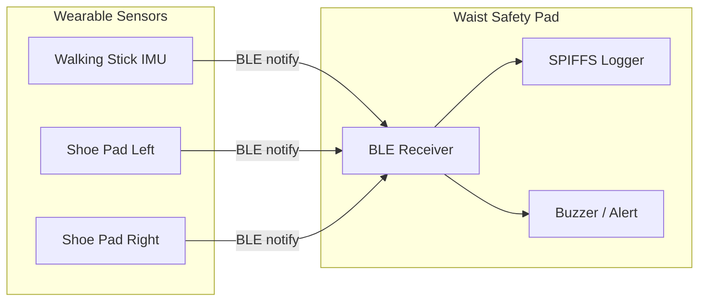

# WalkingStick System Architecture

The WalkingStick platform is a distributed wearable sensor network for mobility assistance, gait monitoring, and fall-risk alerts.

## Components

| Component | MCU | Role |
|-----------|-----|------|
| Waist safety pad | ESP32 | Central hub, data logging, alerts |
| Walking stick | ESP32-C3 | Balance and tilt sensing |
| Shoe pad (left) | ESP32-C3 | Heel / midfoot / forefoot pressure |
| Shoe pad (right) | ESP32-C3 | Heel / midfoot / forefoot pressure |

## Data Flow

## Packet Protocol

All devices share a binary packet format defined in `firmware/shared/protocol/packet.h`:

- **Header**: magic bytes, version, type, role, sequence, timestamp, payload length
- **SensorSample**: IMU readings, pressure zones, battery voltage
- **Alert**: severity level, code, short message

BLE service UUIDs are in `firmware/shared/protocol/ble_uuids.h`.

## Build Targets

Each hardware piece maps to a PlatformIO environment in `platformio.ini`:

- `waist_hub` — flash to the waist safety pad
- `walking_stick` — flash to the stick module
- `shoe_pad_left` / `shoe_pad_right` — flash to each insole pad

## Next Steps for Production

1. Replace IMU stub reads with an MPU6050 or BMI270 driver.
2. Calibrate FSR pressure pads per user and shoe size.
3. Add BLE central scanning on the waist hub to auto-connect peripherals.
4. Export SPIFFS logs over USB serial or Wi-Fi for analysis.
