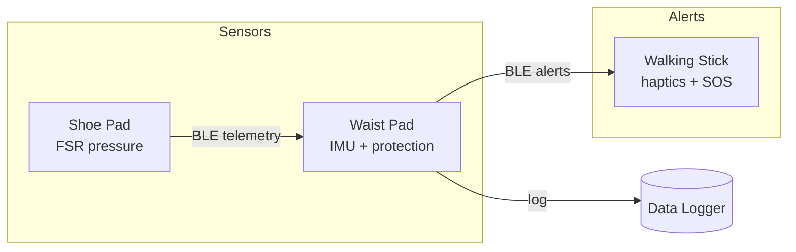

# System Architecture

## Overview

The WalkingStick platform is a three-node wearable system for gait monitoring, fall detection, and local alerting. Each node runs independent firmware built from this repository but shares a common BLE protocol and safety library.

## Device roles

### Waist safety pad (hub)

- Primary **data collector** — receives telemetry from shoe pads and stores samples in an in-memory ring buffer (SD card hooks reserved).
- **Fall and impact detection** via waist-mounted IMU.
- **Protection** — padded enclosure around the waist; firmware triggers buzzer on critical events.
- BLE peripheral that advertises the WalkingStick service.

### Shoe pad (sensor node)

- Four FSR (force-sensitive resistor) channels: left/right heel and toe.
- Detects **gait imbalance** when left/right pressure ratio exceeds threshold.
- Streams pressure telemetry to the waist pad over BLE.

### Walking stick (alert node)

- **BLE central** — scans for other nodes on the WalkingStick service.
- **SOS button** on the handle triggers a local haptic alert.
- **Vibration motor** for fall/low-battery warnings.
- Battery monitoring via ADC.

## Protocol

Defined in `include/protocol.h`.

| Type | Purpose |
|------|---------|
| `SensorSample` | Timestamped accel and/or pressure reading |
| `AlertEvent` | Level, type, source, and message |
| `TelemetryPacket` | Versioned envelope sent over BLE |

BLE service UUID: `a1b2c3d4-e5f6-7890-abcd-ef1234567890`

Characteristics:

- `TELEMETRY_CHAR` — notify sensor data
- `ALERT_CHAR` — notify safety events
- `COMMAND_CHAR` — reserved for remote configuration

## Safety logic

`SafetyMonitor` in `include/safety.h` evaluates:

1. **Fall detection** — accelerometer magnitude above `FALL_ACCEL_THRESHOLD_G`
2. **Impact detection** — magnitude above `IMPACT_THRESHOLD_G` (higher threshold)
3. **Gait irregularity** — left/right pressure imbalance above configurable threshold (adjusted by rollout stage)

Thresholds are configurable in `include/config.h`. The predictive model applies staged rollout sensitivity via `GaitPredictor` and `RolloutManager` — see [deployment.md](deployment.md).

## Build matrix

| Environment | Board | Source filter |
|-------------|-------|---------------|
| `waist_safety_pad` | ESP32 | `src/waist_safety_pad/` |
| `shoe_pad` | ESP32 | `src/shoe_pad/` |
| `walking_stick` | ESP32 | `src/walking_stick/` |

Each environment sets `DEVICE_ROLE` and `BLE_DEVICE_NAME` via compile flags in `platformio.ini`.

## Future extensions

- SD card persistence on waist pad (`pins::waist::SD_CS`)
- Wi-Fi/cloud upload from waist hub
- Replace placeholder IMU driver with MPU6050/BMI160 I2C driver
- OTA firmware updates per node
- Remote rollout configuration via `COMMAND_CHAR` BLE characteristic
- Cloud-based model retraining pipeline
