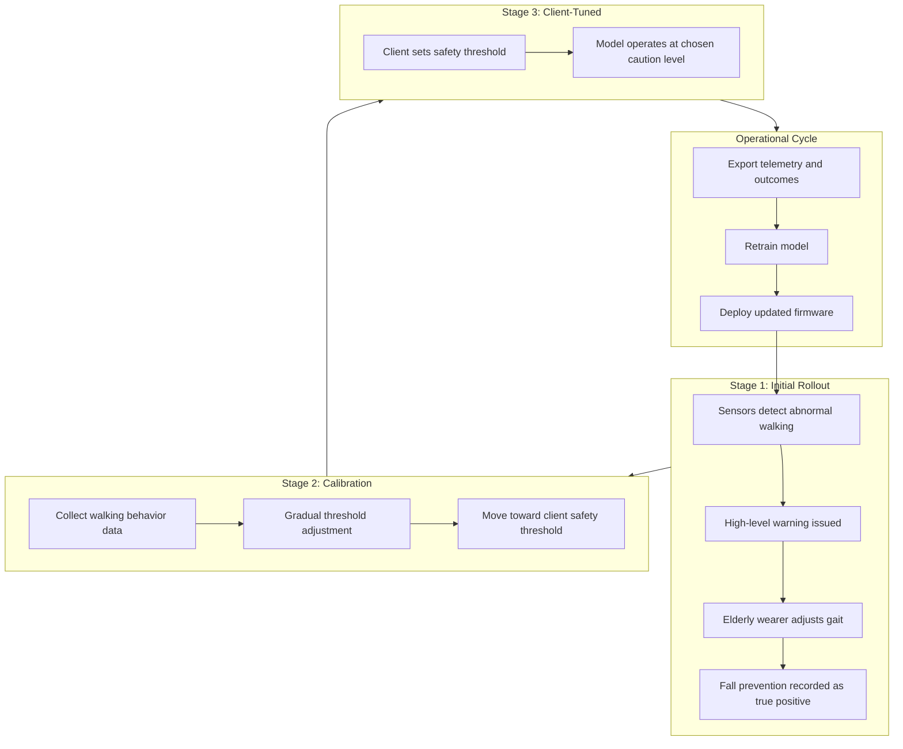

# Predictive Model Deployment

This document describes the staged rollout process for the WalkingStick predictive gait model, including initial high-sensitivity warnings, client threshold tuning, fall-prevention tracking, and periodic model updates by operational teams.

## Overview

Deployment follows a three-stage rollout. The model starts in a high-caution mode to maximize early detection of abnormal walking behavior. Over time, sensitivity is adjusted toward a client-defined safety threshold that reflects how much autonomy the client wants in deciding caution levels. Throughout deployment, the system records successful fall preventions as true positives to improve future model updates.



## Rollout stages

| Stage | Name | Behavior |
|-------|------|----------|
| 0 | **Initial** | High warning sensitivity. Abnormal walking triggers elevated alerts. Gait imbalance threshold lowered to 35% (from default 60%). Fall detection thresholds reduced by 25%. |
| 1 | **Calibrating** | Gradual transition from initial sensitivity toward the client's safety threshold. Progress tracked via `calibration_progress` (0–100). |
| 2 | **Client-tuned** | Client controls caution via `client_safety_threshold` (0–100). Higher values mean more warnings and lower detection thresholds. |

### Stage 1: High-level warnings

During initial deployment, sensors on the shoe pad and waist safety pad feed data to `GaitPredictor`, which applies elevated sensitivity via `RolloutManager`. When abnormal walking is detected:

1. A **warning** is issued to the wearer (buzzer on waist pad, haptic on walking stick when connected).
2. The event is logged with sensor telemetry in the data logger.
3. The system monitors whether gait normalizes within the prevention window (`PREVENTION_WINDOW_MS`, default 10 seconds).

### Stage 2: Gradual threshold adjustment

As walking behavior data accumulates, operational teams advance the rollout to the calibrating stage. Sensitivity interpolates between initial high-caution settings and the client's target threshold:

- **Gait threshold**: moves from `INITIAL_ROLLOUT_GAIT_THRESHOLD` (0.35) toward the client value
- **Fall multiplier**: moves from `INITIAL_ROLLOUT_FALL_MULTIPLIER` (0.75) toward the client value

Increment `calibration_progress` periodically (e.g., weekly) based on data volume and false-positive rate review.

### Stage 3: Client safety threshold

The client sets `client_safety_threshold` (0–100) to control their preferred caution level:

| Threshold | Effect |
|-----------|--------|
| 0 | Least cautious — fewer warnings, higher detection thresholds |
| 50 | Balanced — near default system thresholds |
| 100 | Most cautious — frequent warnings, lowest detection thresholds |

This gives clients autonomy over how aggressively the system warns the wearer.

## Fall prevention and true positives

A **true positive** is recorded when:

1. The model issues a warning for abnormal walking behavior, and
2. The wearer corrects their gait within the prevention window without an impact event.

This is tracked in `ModelMetrics` and logged via `DataLogger::logOutcome()`. True positives represent successful fall preventions and are the primary positive signal for model retraining.

| Outcome | Meaning |
|---------|---------|
| `OUTCOME_TRUE_POSITIVE` | Warning issued, gait normalized — fall prevented |
| `OUTCOME_FALSE_POSITIVE` | Warning issued, no risk materialized within window |
| `OUTCOME_TRUE_NEGATIVE` | No warning, normal walking |
| `OUTCOME_FALSE_NEGATIVE` | No warning, fall or impact occurred |

Metrics are included in telemetry packets (`has_metrics` flag) for export by operational teams.

## Data collection and model updates

### On-device data collection

- **Shoe pad**: pressure samples, gait predictions, prevention outcomes
- **Waist pad**: accelerometer samples, fall/impact predictions, aggregated metrics
- **Data logger**: 64-entry ring buffer (SD card persistence planned)

### Periodic model update workflow

Operational teams perform model updates on a regular cadence (recommended: monthly after initial rollout):

1. **Export data** — retrieve telemetry and outcome logs from waist safety pad (serial, SD card, or future cloud upload).
2. **Review metrics** — analyze true positive rate, false positive rate, and client feedback.
3. **Retrain model** — feed collected walking behavior data and labeled outcomes into the training pipeline.
4. **Validate** — test updated model against held-out deployment data.
5. **Deploy firmware** — flash updated firmware to device nodes (OTA planned).
6. **Adjust rollout stage** — new deployments start at Stage 0; existing deployments may remain at client-tuned stage with updated model weights.

### Remote configuration

The `COMMAND_CHAR` BLE characteristic is reserved for remote rollout configuration. Operational teams can send a `RolloutConfigPacket` to adjust stage, client threshold, and calibration progress without reflashing:

```cpp
struct RolloutConfigPacket {
  uint8_t stage;                    // RolloutStage enum
  uint8_t client_safety_threshold;  // 0-100
  uint8_t calibration_progress;     // 0-100
};
```

## Configuration reference

Key parameters in `include/config.h`:

| Parameter | Default | Description |
|-----------|---------|-------------|
| `GAIT_IMBALANCE_THRESHOLD` | 0.6 | Baseline gait imbalance ratio |
| `INITIAL_ROLLOUT_GAIT_THRESHOLD` | 0.35 | Stage 1 gait threshold (more sensitive) |
| `INITIAL_ROLLOUT_FALL_MULTIPLIER` | 0.75 | Stage 1 fall threshold multiplier |
| `DEFAULT_CLIENT_SAFETY_THRESHOLD` | 70 | Default client caution level |
| `PREVENTION_WINDOW_MS` | 10000 | Window to detect gait correction after warning |

## Deployment checklist

### Pre-deployment

- [ ] Calibrate FSR pressure sensors on shoe pads
- [ ] Verify IMU driver on waist safety pad
- [ ] Set initial `RolloutConfig` to `ROLLOUT_INITIAL`
- [ ] Flash all three device nodes
- [ ] Confirm BLE connectivity between nodes

### Stage 1 (weeks 1–2)

- [ ] Monitor warning frequency and wearer feedback
- [ ] Verify true positive recordings in serial logs
- [ ] Document any false positives for calibration review

### Stage 2 (weeks 3–6)

- [ ] Advance to `ROLLOUT_CALIBRATING`
- [ ] Increment `calibration_progress` based on data review
- [ ] Work with client to set target `client_safety_threshold`

### Stage 3 (ongoing)

- [ ] Transition to `ROLLOUT_CLIENT_TUNED`
- [ ] Client adjusts safety threshold as needed
- [ ] Export data monthly for model retraining
- [ ] Deploy model updates per operational schedule

## Related documentation

- [architecture.md](architecture.md) — system design and protocol
- [hardware.md](hardware.md) — sensor wiring and assembly
- `include/gait_predictor.h` — predictive safety layer
- `include/model_rollout.h` — rollout stage management
- `include/model_metrics.h` — outcome tracking
